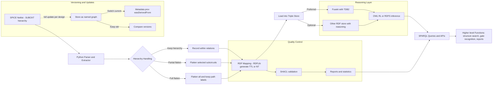
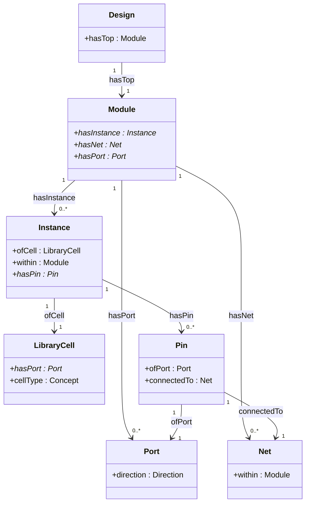

---

**要点说明（对应上图）：**

* **输入**：第一期聚焦 *SPICE*；保留 `.SUBCKT` 层次信息，便于后续层次化分析与模式识别。
* **解析/抽取（Python）**：建议用 *RDFLib* 产出 TTL/NT。对 10k 实例规模，单机批量写出即可。
* **层次策略**：支持“保留层次 / 部分展开 / 完全展开”，三种都走同一 RDF 映射（通过 `c:within` 与层次化 URI 编码兼容）。
* **质量管控**：用 **SHACL** 做必备约束（如 `Instance→Module` 隶属、`Pin↔Net` 连通、端口方向一致性）。
* **存储**：默认 **Fuseki+TDB2**；如需更丰富的规则/内置 UI，可替换为其它开源图数据库（保持 SPARQL 兼容）。
* **推理**：默认开启轻量 **RDFS/OWL-RL**（类继承、等价类/属性、简单链路），为“门族归类、别名归并、角色继承”提供底层支撑。
* **版本化与更新**：你是“整机全量更新”，因此**每次导入新命名图**，切换“当前版本”指针即可，实现可回溯与 A/B 对比。
* **上层功能**：基于 SPARQL 模板与（可选）规则推理构建：结构搜索、门级识别、统计报表、扇出/扇入分析等。

---

**推理与校验边界（简述）：**

* **RDFS/OWL-RL 推理**（开启后）：

  * `c:NAND2 rdfs:subClassOf c:LogicGate` → 实例自动提升为 `c:LogicGate`。
  * `owl:equivalentClass` / `owl:equivalentProperty` 用于库别名归并（如 NAND2 ≡ NAND2_X1 家族）。
  * 简单属性链（如 `hasPin ∘ ofPort ∘ direction → roleOfPin`）可在 OWL-RL 限制内表达，便于“自动标注驱动/受端”。
* **SHACL 校验**（导入后）：

  * 结构完整性：`Instance` 必须有 `within` 与 `ofCell`；`Pin` 必须 `connectedTo` 某 `Net`。
  * 方向一致性：连接到同一 `Net` 的多个 `Pin` 中至少存在一个 `output`/多个 `input` 的合法组合（可先做“软校验/告警”）。

---

### 实施拍板清单（精简）

* **ETL（Python）**：`spice→AST→RDF`；配置三种层次策略；输出 `design.ttl` + `library.ttl` + `shapes.ttl`。
* **后端**：先上 **Fuseki**；如需更强内置推理/可视化，再切换兼容的开源库（同 SPARQL 接口）。
* **版本化**：每个电路版本独立命名图；元数据记 `prov:wasDerivedFrom`、生成时间、工具版本。
* **规模目标**：首期 ~10k 实例；采用离线批量装载（Bulk load）优先，保持查询交互顺畅。

